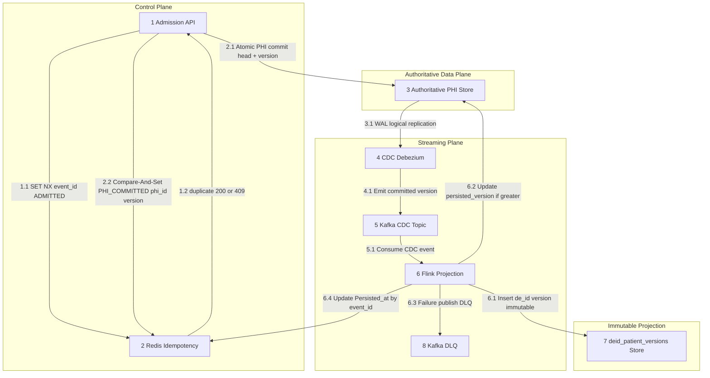
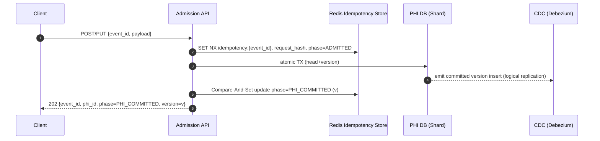
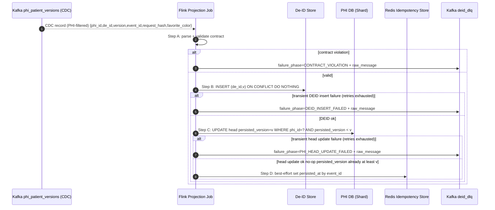
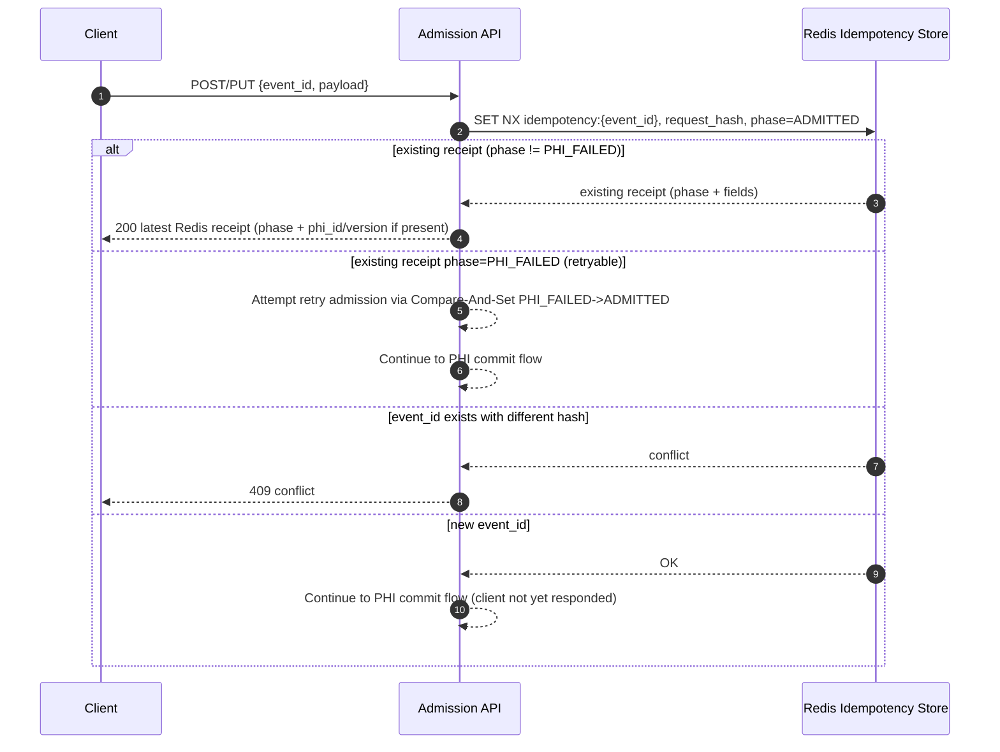
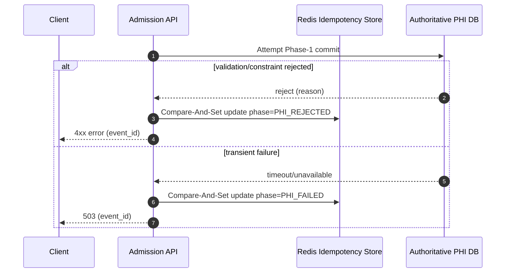
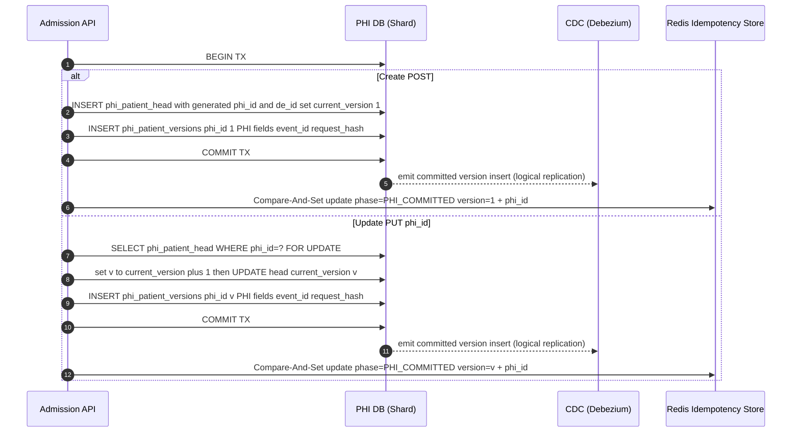
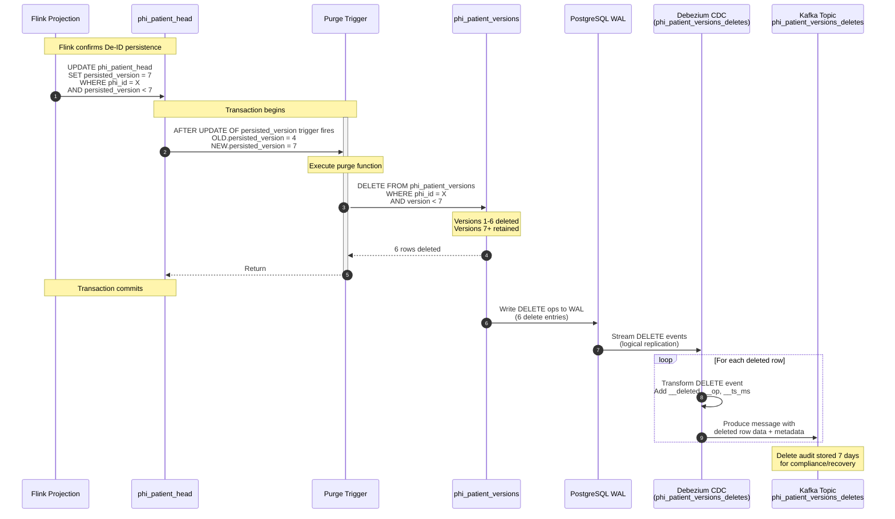
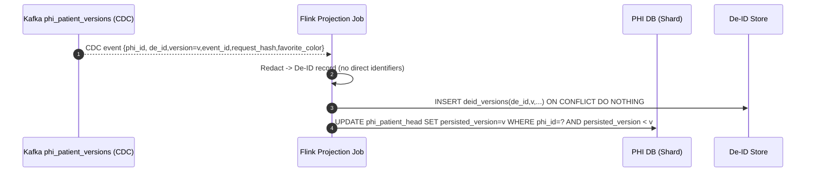

# Patient Events Platform v2 (Write Workflow Only)

## 1. Mission

We are building a patient events platform for real-time ingestion with strict idempotency and authoritative PHI versioning, while persisting an immutable De-identified Patient Record downstream via a CDC commit stream from the PHI DB (CDC is configured to exclude PHI fields).

Primary goals:
- Sustain **1,000,000 writes per minute** (~16,667/sec) at ~20KB/request.
- Achieve **p99 ≤ 5 seconds** from admission to De-ID record being readable by key in healthy conditions.
- Enforce De-identification separation (no direct identifiers in De-ID stores or Kafka payloads).
- Prevent divergence: event lifecycle, PHI version assignment, and De-ID persistence must connect back to one authoritative truth.
- Allow internal identifiers (phi_id, de_id) in the CDC stream for routing/confirmation while excluding PHI attributes from CDC/Kafka payloads.



### 1.1 Document Structure

This document is organized as follows:
- Mission
- Functional Requirements
- Non-Functional Requirements
- Invariants
- Scope (In-Scope / Out-of-Scope / Assumptions)
- Inferences and Design Rationale
- Interfaces
- Data Model
- Contracts
- Failure & Recovery
- Deployment Technology Choices (Take-Home vs Production Direction; note client-driven sharding)
- Sequence Diagrams (API Overview, Flink Overview, then detailed flows)
- DDL & Message Contracts (Liquibase YAML, Kafka, API schema)
- Project Implementation Notes (Python Flink, Java API, Docker Compose, directory layout)
- Tests (and directories)

## 2. Problem Statement (Base Requirements)

- Handle 1 million writes per minute (~20KB per request) with de-duplication.
- Less than 2–5 second end-to-end ingest latency (ingest → queryable).
- On-the-fly de-identification: write ePHI to an authoritative PHI system; write De-ID to a separate store/environment.
- Example: input contains Name, DOB, Favorite Color; output includes PHI record with identifiers and De-ID record with only Favorite Color keyed by an obfuscated token.

## 3. Functional Requirements

- FR-1: Caller must provide `event_id` (UUID). The same `event_id` must not be reused for a semantically distinct request within the 4-hour idempotency window.
- FR-2: Admission API must prevent duplicate work for the same `event_id` within the 4-hour TTL window by returning the existing receipt/status (no duplicate PHI commit). Duplicate requests return HTTP 200 with the latest known receipt. If the stored phase is `PHI_FAILED` and `request_hash` matches, the request is retryable and MUST re-attempt PHI commit.
- FR-3: Admission API must detect payload mismatch for the same `event_id` (e.g., request_hash differs) and return HTTP 409 without mutating state.
- FR-4: For a new `event_id`, the Admission API must durably persist `ADMITTED` in Redis before beginning PHI commit, and must not respond 202 until `PHI_COMMITTED` is recorded in Redis. Duplicate `event_id` requests return HTTP 200 with the latest known receipt, except `PHI_FAILED` which is retryable (see FR-11).
- FR-5: For create, identifiers (`phi_id`, `de_id`) are generated by the API service (UUIDv4) prior to the PHI commit transaction. For a new `event_id`, Redis is first durably created with `phase=ADMITTED` (receipt contains only `request_hash` + phase). The API then generates `phi_id` and `de_id`, computes the PHI shard via `hash(phi_id) % shard_count`, and executes the atomic PHI DB transaction that INSERTs a new PHI head row with those identifiers and writes the immutable PHI version row. Only AFTER commit does the API update Redis to `PHI_COMMITTED` including `phi_id` and `version` (never `de_id`). If a UUID collision occurs (unique constraint violation), the API MUST generate new UUIDs and retry the transaction before responding.  
TODO (Production): when the PHI store is physically sharded, `de_id` must be allocated by a global De-ID Coordinator + pre-allocation queue to guarantee uniqueness beyond per-shard constraints.
- FR-6: Update requires `phi_id` path parameter; create does not require `phi_id` from the caller because `phi_id` is generated by the API (UUIDv4) prior to the PHI commit transaction.
- FR-7: Authoritative PHI store must write PHI attributes (name, dob, favorite_color) and assign a strictly increasing version.
- FR-8: After a successful PHI commit, the change must be observable as a CDC event emitted from the PHI DB (Debezium/Postgres logical replication) for the committed PHI version row. This CDC event is the authoritative “commit stream” for downstream De-ID persistence (no application-managed outbox table).
- FR-9: Flink must consume CDC events for PHI version inserts. Flink persists an immutable De-ID record keyed by (de_id, version) and then confirms by updating persisted_version in the PHI head row using phi_id via a strictly monotonic conditional update (UPDATE … WHERE persisted_version < v). Redis receipt may optionally be updated if the idempotency key still exists, but correctness does not depend on Redis.
- FR-10: If the PHI store rejects the request (validation/constraints), the Redis receipt must be updated to `PHI_REJECTED` and the API must return an error to the client.

- FR-11: If Redis receipt is `PHI_FAILED` for the same `event_id` and `request_hash` matches, a client retry MUST attempt PHI commit again (not return HTTP 200). If the retry succeeds, the API returns 202 with `phase=PHI_COMMITTED` and the assigned version.

## 4. Non-Functional Requirements

- NFR-1 Latency: p99 ≤ 5s admission → De-ID readable-by-key (healthy).
- NFR-2 Degraded mode: bounded recovery; the De-ID pipeline must either persist immutably (reflected via persisted_version advance) or publish a DLQ envelope for manual repair. Redis does not reflect DEID_DLQ or downstream projection states.
- NFR-3 Safety: no PHI fields in Kafka payloads (CDC is column-filtered/masked); De-ID store contains no direct identifiers.
- NFR-4 Durability: PHI versions are authoritative and retained for years; De-ID persistence is replayable and idempotent.
- NFR-5 Scalability: Redis (idempotency) and the PHI Store must scale via **logical sharding** driven by API/Flink routing.
- NFR-6 Operability (take-home): single-machine Docker Compose with resource caps and simplified components.
- NFR-7 Redis persistence is used to reduce client-visible status loss; Redis status is not correctness-critical (authoritative correctness is PHI + cdc + immutable De-ID).

## 5. Invariants

### Invariant 1: Global Idempotency by event_id (4-hour window)

Guarantee:
- For any caller-provided `event_id`, duplicates within a **4-hour TTL window** MUST NOT start new work and MUST return the latest known receipt from Redis, **except** when the stored phase is `PHI_FAILED` (retryable) and `request_hash` matches; in that case a retry MUST re-attempt PHI commit.
- If the same `event_id` is presented with a different payload than originally admitted (`request_hash` differs), the request is rejected (HTTP 409), does not mutate PHI, and MUST NOT return `phi_id` or `version`.

### Invariant 2: Redis-Backed Duplicate Rejection (Admission Backstop)

Guarantee:
- Prior to starting create/update work, the Admission API must attempt Redis admission using:
  - `SET idempotency:{event_id} <value> NX EX 4h`
- If the key already exists:
  - The API MUST `GET` the stored value and compare `request_hash`.
    - If `request_hash` differs: return HTTP 409 and do not mutate PHI and do not return `phi_id/version`.
    - If `request_hash` matches and stored phase is `PHI_FAILED`: the API MUST attempt a Compare-And-Set transition `PHI_FAILED -> ADMITTED` (retry admission) and then re-attempt PHI commit.
    - Otherwise (hash matches and phase != PHI_FAILED): return HTTP 200 with the latest known receipt from Redis (and `phi_id/version` if present).
- If Redis is unavailable, admission fails closed: reject and do not attempt PHI commit.

### Invariant 3: Durable Admission Acknowledgement (Redis)

Guarantee:
- For a new `event_id`, the API must not begin PHI commit until Redis durably reflects `phase=ADMITTED` for that `event_id`.
- The API must not respond 202 until Redis reflects `phase=PHI_COMMITTED` with `phi_id` and `version=v`.
- Redis updates must be monotonic and non-destructive: once PHI_COMMITTED is written, it must not be overwritten by ADMITTED, and updates that add/refresh fields must merge rather than overwrite (use Compare-And-Set/Lua or equivalent compare-and-set rules).
- Redis persistence is used to reduce client-visible status loss; Redis status is not correctness-critical (authoritative correctness is PHI + cdc + immutable De-ID).

Implementation note: use a Lua script (or equivalent Compare-And-Set) to compare the stored phase rank and only allow forward transitions.

### Invariant 4: Atomic PHI Commit (Authoritative Phase-1)

Guarantee:
- The transition to `PHI_COMMITTED(version=v)` occurs only if a **single** atomic database transaction durably writes:
  1) the PHI head row update (`current_version = v`, monotonic),
  2) the immutable PHI version row `(phi_id, v)` containing PHI attributes
- No partial PHI_COMMITTED is visible.

### Invariant 5: Monotonic Version Authority

Guarantee:
- For a given `phi_id`, versions strictly increase. `current_version` never decreases.
- Version assignment is the sole ordering authority for PHI mutations.

### Invariant 6: Commit Before Emit (CDC)

Guarantee:
- Downstream De-ID persistence is driven only by CDC events emitted from the authoritative PHI database for committed inserts into `phi_patient_versions`.
- Because CDC reads from the database WAL/logical replication stream, a CDC event is emitted only after the PHI commit is durable.
- CDC outages do not cause lost committed versions as long as WAL retention/replication slots are preserved; the connector resumes from its last confirmed position and replays missing commits.
- Publication progress is observable via CDC connector lag/offsets (operational), while correctness remains enforced by the PHI tables + immutable De-ID store.

### Invariant 7: De-identification Separation

Guarantee:
- De-ID records contain no direct identifiers.
- Kafka messages contain no PHI attributes.
- The De-ID key (`de_id`) is non-derivable from PHI fields.
- The privileged PHI read interface can resolve `phi_id` (and thus PHI versions), but the De-ID store cannot be used to reconstruct PHI.
- `de_id` is a permanent, non-reassignable token: once associated to a `phi_id`, it must never be reassigned to a different `phi_id` (ever).
Note: Failed PHI transactions do not commit identifier assignments; UUID defaults may be evaluated during retries, but only committed rows define authoritative identities.

### Invariant 8: Immutable De-ID Persistence

Guarantee: 
- The De-ID store is immutable by (de_id, version) (PK). Replays may attempt to write the same key again; duplicate writes must have an idempotent effect (either ON CONFLICT DO NOTHING or “duplicate key treated as success”) and must never overwrite an existing record.

### Invariant 9: Persisted Version Monotonicity

Guarantee:
- The PHI head row tracks both `current_version` and `persisted_version`.
- Flink confirmation advances persisted_version only when v is greater (e.g., UPDATE ... WHERE persisted_version < v).
- `persisted_version` never decreases.

### Invariant 10: No Version Loss Between PHI and De-ID

Guarantee:
- Every PHI commit inserts phi_patient_versions(phi_id, v) durably; CDC emits that committed insert via WAL/logical replication.
- De-ID persistence is driven from the cdc/Kafka pipeline and is immutable/idempotent by `(de_id, version)`.
- Redis status is used for dedupe and client-visible receipt during the 4-hour window; loss of Redis status after admission does not affect the correctness of already-committed PHI/cdc/De-ID work.

### Invariant 11: Stale or Late Updates

Guarantee:
- The PHI head must never regress below `persisted_version`.
- Projection confirmations may arrive out of order; Flink confirmation updates must use a strictly monotonic conditional update (UPDATE … WHERE persisted_version < v) so persisted_version never decreases and no-op updates are avoided.
- Even if a confirmation arrives after a newer `persisted_version` already exists, the immutable De-ID record `(de_id, v)` may still be persisted if missing, and `persisted_version` must still be monotonic.

### Invariant 12: Bounded PHI Version Retention

Guarantee:
- The PHI Store retains only versions at or above `persisted_version` for operational hot-storage needs.
- When `persisted_version` advances for a given `phi_id`, older versions (version < `persisted_version`) are **automatically purged** via database trigger to bound storage growth.
- Purge happens in the same transaction as the `persisted_version` update, ensuring atomic cleanup.
- This prioritizes bounded storage and predictable performance over retaining full PHI history in the primary database.
- Any compliant deletion/erasure process beyond operational purging is out-of-scope for this design.

### Invariant 13: Purge Trigger Atomicity and Safety

Guarantee:
- A database trigger `trg_purge_old_phi_versions_on_persisted_update` executes on `AFTER UPDATE OF persisted_version` for `phi_patient_head`.
- The trigger runs only when `persisted_version` actually changes (`OLD.persisted_version IS DISTINCT FROM NEW.persisted_version`).
- The trigger deletes from `phi_patient_versions` WHERE `phi_id = NEW.phi_id` AND `version < NEW.persisted_version`.
- Purge occurs in the same transaction as the Flink confirmation update, ensuring atomicity.
- The trigger never deletes versions ≥ `persisted_version`; the current operational window is preserved.
- Implementation: Liquibase changeSet `041-phi-version-purge-trigger`.

### Invariant 14: Delete Audit Trail (Compliance)

Guarantee:
- All DELETE operations on `phi_patient_versions` are captured via a dedicated Debezium CDC connector (`phi_patient_versions_deletes`).
- Deleted records are streamed to Kafka topic `phi_patient_versions_deletes` with 7-day retention.
- Each delete message includes the full row data plus metadata (`__deleted: true`, `__op: "d"`, `__ts_ms`).
- This provides a bounded compliance audit trail for purged PHI versions.
- After the 7-day Kafka retention window, deleted data is unrecoverable.
- Delete tracking is passive (no downstream processing); the topic serves audit/recovery use cases only.

**Prerequisite**: The `phi_patient_versions` table must have `REPLICA IDENTITY FULL` configured. Without this PostgreSQL setting, logical replication only captures primary key columns on DELETE, resulting in incomplete audit records. This requirement is enforced via Liquibase changeSet 042.


## 6. Scope

### 6.1 In-Scope

- Admission API: create + update workflows with caller-provided event_id.
- Redis Idempotency Store: duplicate protection, request_hash conflict detection, and client-visible receipt phases within a 4-hour TTL window.
- Authoritative PHI Store: atomic commit, strict version assignment, current_version and persisted_version tracking, immutable version rows.
- **Automatic Purge Trigger**: database trigger that deletes older PHI versions (version < persisted_version) when Flink advances `persisted_version`, ensuring bounded storage growth.
- **Delete Audit Tracking**: dedicated CDC connector (`phi_patient_versions_deletes`) captures all DELETE operations on `phi_patient_versions` and streams them to Kafka topic `phi_patient_versions_deletes` with 7-day retention for compliance audit trail.
- CDC (Debezium/Postgres logical replication): emits committed PHI version rows as the authoritative commit stream for De-ID persistence.
- Kafka Topics: `phi_patient_versions` (CDC), `phi_patient_versions_deletes` (delete audit), and `deid_dlq`.
- Flink Projection: consume CDC event, persist De-ID immutably, then advance persisted_version in phi_patient_head by de_id using a strictly monotonic conditional update (e.g., UPDATE phi_patient_head SET persisted_version = :v, last_updated_at = NOW() WHERE phi_id = :phi_id AND persisted_version < :v;).
- Minimal read endpoints required to validate 'queryable by key'.

### 6.2 Out-of-Scope

- Control-plane vs data-plane separation beyond what is needed for the take-home.
- Authorization boundaries and access controls (beyond privileged endpoint placeholder).
- Audit logs and compliance-grade immutability claims (beyond append-only versioned rows).
- Cost showback/chargeback.
- Full observability platform (dashboards/alerts), beyond phase timestamps.
- Multi-region active/active.
- Deletes, GDPR erasure, right-to-be-forgotten workflows.
- Rich query APIs for analytics (e.g., search by favorite color across the entire population).
- TODO: Use request_hash along with event_id to make sure Redis updates are correct. Otherwise, remove request_hash from CDC/Kafka Connect/Flink if not needed.
- TODO (DLQ processing): the envelope enables manual repair and replay without losing PHI versions.
- Cold storage / long-term archival: production deployments requiring retention beyond the operational window (versions ≥ persisted_version) must implement asynchronous archival workflows to object storage before purge. The current design bounds primary storage via automatic purging; long-term compliance retention is out-of-scope.

### 6.3 Assumptions

- event_id is unique within the 4-hour idempotency window. Reuse of an `event_id` after TTL expiry is allowed by contract (see TODO on idempotency TTL sizing).
- TODO (idempotency TTL sizing / reuse): idempotency is guaranteed within the Redis TTL window (4 hours). Future work should validate memory sizing, eviction policy (no-eviction), and whether to shorten TTL (e.g., 1 hour) to reduce key volume and allow safe event_id reuse after the window.
- Create returns phi_id and phase=PHI_COMMITTED (with version) after durable event receipt and PHI commit are recorded. User does not provide phi_id.
- Queryable means the De-ID record exists and is readable by key via `phi_id` (the API resolves `de_id` internally and performs a key read of (de_id, persisted_version)).
- **PHI version retention is bounded**: only versions ≥ `persisted_version` are retained in `phi_patient_versions`. When Flink advances `persisted_version`, older versions are automatically purged via trigger. Deleted records are captured in Kafka topic `phi_patient_versions_deletes` with 7-day retention for audit/recovery.
- **Storage sizing assumes bounded retention**: capacity planning targets operational hot-storage needs (recent versions), not multi-year full history. Production deployments requiring long-term compliance retention must archive purged versions to cold storage before deletion.
- Prototype uses single region; production uses logical shards and partitioned Kafka topics.
- Kafka ordering is relied on only for operational convenience; correctness is enforced by version gating and idempotent writes.
 - TODO (CDC operational hardening): define WAL retention/replication slot policies, connector deployment (Kafka Connect), and monitoring for connector lag so committed PHI versions are not lost during extended outages.
 - TODO (global `de_id` uniqueness under sharding): introduce a De-ID Coordinator + pre-allocation queue; take-home uses API-generated UUIDv4 with unique constraint + retry.
 
- TODO (background reconciliation for Redis receipts):
  In production, implement a background reconciler that scans Redis idempotency keys
  where phase=ADMITTED and TTL has not expired. For each such key:
    1) Lookup authoritative state by event_id (not by payload hash).
    2) If a PHI commit exists, validate that the stored request_hash matches the
       authoritative request_hash before advancing Redis to PHI_COMMITTED.
    3) If hashes mismatch, do NOT attach phi_id/version and surface an alert.
  The reconciler must treat event_id as the primary join key and use request_hash
  only as a validation guard (not as a search key). The reconciler must never
  resurrect expired TTL keys and must use Compare-And-Set/monotonic updates to avoid
  overwriting PHI_COMMITTED with ADMITTED.

## 7. Inferences and Design Rationale

- At 1M writes/min, a single Postgres instance is unlikely to sustain production scale with strict atomic commits. The production direction requires **logical sharding** of the authoritative databases.
- The Admission API and Flink must be able to route to shards deterministically. The shard key is `phi_id` for PHI. Redis idempotency is keyed by `event_id` and may be scaled via Redis Cluster or partitioned keyspaces.
- Kafka is not authoritative for correctness; the authoritative truth is stored in the PHI Store (head + versions). Redis is used only for idempotency and client-visible receipt status within the TTL window.
- The cdc pattern ensures no committed PHI version is dropped while avoiding distributed transactions across PHI and Kafka.

### UUID Generation Strategy

- UUIDv4 identifiers (`phi_id`, `de_id`) are generated in the API layer to enable deterministic shard routing before database interaction.
- This avoids cross-shard coordination for identifier allocation.
- Collision probability at 325M scale is effectively negligible; unique constraints remain in place as a safety guard.
- On collision, the API regenerates identifiers and retries the transaction transparently.

### TODO (Significant): Global `de_id` Uniqueness Coordinator + Pre-Allocation Queue (Production)

Problem:
- Under **logical sharding by `phi_id`**, independent Postgres shards cannot enforce a **global** `UNIQUE(de_id)` constraint. A per-shard unique index only guarantees uniqueness **within a shard**.

Take-home approach:
- The API generates `de_id` as **UUIDv4** and enforces `UNIQUE(de_id)` on the **single** Postgres instance.
- On a (vanishingly rare) collision (unique constraint violation), the API regenerates `de_id` and retries the transaction.

Production direction (future work):
- Introduce a **De-ID Coordinator service** that allocates globally unique `de_id` values and places them into a **pre-allocation queue** for consumption by the Admission API.
- The Admission API consumes `de_id` from this queue (or requests one synchronously) prior to the PHI commit transaction.
- This component becomes the **global uniqueness authority** for `de_id` when the PHI store is physically sharded.

Design sketch (non-implemented):
- Coordinator: single-writer or consensus-backed allocator that issues non-overlapping identifiers.
- Queue: durable stream/queue containing pre-generated `de_id` tokens (with at-least-once delivery semantics; consumers must handle duplicates defensively).
- Operations: refill policy, backpressure, and outage behavior (API fails closed if no `de_id` tokens are available).

Rationale:
- This avoids probabilistic uniqueness claims under sharding and provides a deterministic global uniqueness contract for `de_id`.

## 8. Interfaces

### 8.1 REST APIs (Required)

- POST /api/v1/patient -> 202 {event_id, phi_id, phase='PHI_COMMITTED', version}
- PUT /api/v1/patient/{phi_id} -> 202 {event_id, phi_id, phase='PHI_COMMITTED', version}

Note:
ADMITTED is the first durable phase recorded for any new event_id (create or update) after event_id validation.

For first-time requests, the API returns only after PHI_COMMITTED with the assigned version.

The API MUST NOT return a newly allocated phi_id to the client until after the PHI DB transaction commits and Redis reflects PHI_COMMITTED.

For duplicate requests (same `event_id` within the TTL window), the API returns HTTP 200 with the latest known Redis receipt:

- If phase=ADMITTED, return 200 {event_id, phase="ADMITTED"}.
- If phase=PHI_COMMITTED, return 200 {event_id, phi_id, phase="PHI_COMMITTED", version=v}.
- If phase=PHI_REJECTED, return 200 with the error status (omit phi_id/version).
- If phase=PHI_FAILED, the API MUST re-attempt PHI commit; on success return 202 {event_id, phi_id, phase="PHI_COMMITTED", version=v}.

### 8.2 REST APIs (Validation Reads)

- GET /api/v1/deid/patients/by-deid/{de_id}
- GET /api/v1/deid/patients/by-phi_id/{phi_id} -> reads `de_id` and `persisted_version` from `phi_patient_head(phi_id)`, then performs a key read of `(de_id, persisted_version)` (or 404). -> privileged PHI read boundary (mocked).
- GET /api/v1/phi/patients/by-deid/{de_id}?version=<v|latest> -> privileged PHI read boundary (mocked).
- GET /api/v1/phi/patients/by-phi_id/{phi_id} -> privileged PHI read boundary (mocked).


### 8.3 Kafka Topics

- **phi_patient_versions** (CDC): change events for committed inserts into phi_patient_versions. CDC payload excludes PHI columns (name, dob, etc.) but includes internal identifiers and projection fields needed downstream: phi_id, de_id, version, event_id, request_hash, and non-PHI attributes (e.g., favorite_color). Flink consumes this as the authoritative commit stream.
- **phi_patient_versions_deletes** (CDC delete audit): change events for DELETE operations on phi_patient_versions. Dedicated Debezium connector captures purged rows with **ALL attributes including PHI data** (name, dob, favorite_color, etc.) plus metadata (`__deleted`, `__op`, `__ts_ms`). 7-day retention provides bounded compliance audit trail for recovery/rollback scenarios. No downstream processing; passive audit use case only. **Security note**: this topic contains PHI and requires appropriate access controls and encryption.
- **deid_dlq**: terminal failure envelope for projection failures (value-only JSON envelope).

## 9. Data Model Overview

Logical entities (authoritative roles):

- PHI Head (`phi_patient_head`) — **authoritative mutable per-patient state and serialization point**.
  - Owns identity linkage (`phi_id` ↔ `de_id`) and the authoritative version counters (`current_version`, `persisted_version`).
  - The row-level lock on the head row is the mechanism that prevents concurrent writers from independently advancing versions.

- PHI Versions (`phi_patient_versions`) — **authoritative immutable history (bounded retention)**.
  - Stores the full PHI payload for every committed version as `(phi_id, version)`.
  - Append-only during writes; automatically purged when `persisted_version` advances (trigger deletes versions < `persisted_version`).
  - Only operational hot-storage versions (version ≥ `persisted_version`) are retained in primary database; purged versions are captured in Kafka delete audit topic for 7 days.

- CDC Commit Stream (Debezium over Postgres logical replication) — **authoritative emission of committed PHI versions**.
  - Emits inserts to `phi_patient_versions` after commit as a change stream.
  - Downstream correctness does not rely on Kafka ordering; version gating + immutable writes enforce correctness.

- Redis Idempotency Receipt: ephemeral (4-hour TTL) dedupe and receipt record keyed by event_id.

- De-ID Versions: immutable De-ID records keyed by (de_id, version); functionally corresponds to (phi_id, version) via stable tokenization.


Note on sharding:
- PHI Store shard key: hash(phi_id).
- CDC colocated with PHI shard.
- De-ID Store shard key: hash(de_id) (or colocated with PHI shard in take-home).

## 10. Contracts

### 10.1 Admission Contract

1) Compute request_hash from the request payload.
2) Attempt Redis admission: SET idempotency:{event_id} value NX EX 4h where value initially includes {request_hash, phase=ADMITTED}.
3) If Redis SET fails because key exists:
   - GET the existing value.
   - If stored request_hash differs, return 409 and do not mutate PHI and do not return phi_id/version.
   - If stored request_hash matches and stored phase is PHI_FAILED: perform a Compare-And-Set transition PHI_FAILED->ADMITTED and continue to PHI commit; on success return 202 PHI_COMMITTED with version.
   - Otherwise (hash matches and phase != PHI_FAILED): return HTTP 200 with the latest known phase from Redis (and phi_id/version if present).
4) If Redis is unavailable, reject (fail closed) and do not attempt PHI commit.
5) If Redis SET succeeds (new event_id):
   - For create:
     - Generate `phi_id` and `de_id` in the API (UUIDv4).
     - Compute shard = hash(phi_id) % shard_count.
     - Do NOT write `phi_id` into Redis yet. The Redis receipt remains `ADMITTED` until the PHI DB transaction commits.
     - Execute PHI DB transaction that INSERTs `phi_patient_head(phi_id, de_id, ...)` and INSERTs the immutable `phi_patient_versions(phi_id, v=1, ...)`.
     - If a unique constraint violation occurs on `phi_id` or `de_id`, generate new UUIDs and retry before returning.
   - For update:
     - `phi_id` is provided by the caller.
     - Compute shard = hash(phi_id) % shard_count.
     - Route request to the correct shard before executing the atomic transaction.
6) Execute atomic PHI commit in one transaction.
   - For create: use API-generated `phi_id` and `de_id`, INSERT the head row as the serialization point (v=1), and INSERT the immutable version row.
   - For update: lock the existing head row by `phi_id`, increment `current_version` to v, and INSERT the immutable version row.
   (CDC emission happens after commit via WAL/logical replication.)
7) AFTER the PHI transaction commits, update the Redis receipt to PHI_COMMITTED with phi_id and version=v using a monotonic/Compare-And-Set update that merges fields (must not overwrite/erase previously stored identifiers or metadata, and PHI_COMMITTED cannot be overwritten by ADMITTED).
8) Return 202 {event_id, phi_id, phase="PHI_COMMITTED", version=v}.

### 10.2 PHI Commit Contract

Phase-1 commit must be atomic:
- For update: lock or serialize on phi_id (row-level lock on head).
- For create: API generates `phi_id` and `de_id` (UUIDv4), routes to the correct shard via hash(phi_id) % shard_count, INSERTs the head row using those identifiers, and treats the insert as the serialization point for version v=1.
- Assign version v (update: increment current_version to v; create: set current_version=v=1 on insert).
- Insert PHI version row (phi_id, v) with PHI fields.
- The version insert is what CDC emits.

After the PHI transaction commits successfully, the Admission API must idempotently update the Redis idempotency receipt to `PHI_COMMITTED(version=v)` using a monotonic/Compare-And-Set update so that PHI_COMMITTED cannot be overwritten by ADMITTED.

If the PHI DB rejects (validation/constraint), the Redis idempotency receipt transitions to PHI_REJECTED and the API returns the corresponding error.

PHI_FAILED (transient, retryable): If the PHI transaction cannot be attempted or cannot complete due to transient errors (timeouts, unavailable shard, deadlocks/serialization failures beyond retry policy), the API updates Redis to PHI_FAILED and returns 503. A retry with the same event_id and matching request_hash MUST re-attempt the PHI commit (see 10.1).

### 10.3 Projection Contract

Flink projection must (CDC-driven):

- Consume CDC events for inserted PHI version rows containing (phi_id, de_id, version=v, event_id, request_hash, non-PHI attributes such as favorite_color). PHI attributes (e.g., name, dob) are excluded/masked.
- Redact/construct De-ID record (no direct identifiers; do not propagate PHI).
- Persist immutably to De-ID Store with primary key (de_id, version).
- Confirm by advancing persisted_version only if it would increase (avoid no-op updates): UPDATE phi_patient_head SET persisted_version = v,last_updated_at = NOW() WHERE phi_id = :phi_id AND persisted_version < v;

  - If bounded retries fail, publish a DLQ envelope (manual repair path). Redis may optionally be updated with `projection_confirmed_at` if the idempotency key still exists, but correctness does not depend on Redis.

This keeps phi_id available for shard routing and persisted_version confirmation while still enforcing PHI field masking (CDC excludes PHI attributes such as name/dob).

#### 10.3.1 Flink Projection Steps + DLQ Phases (Explicit)

For each Kafka message on `phi_patient_versions`, Flink processes in the following strict order:

**Step A — Parse + Contract Validation (Fail-Fast)**
- Validate required fields exist and have correct types: `phi_id`, `de_id`, `version`, `event_id`, `request_hash`.
- Validate PHI safety: the CDC/Kafka Connect SMT configuration **removes PHI fields** (e.g., `name`, `dob`) before messages reach Flink. Flink still defensively rejects any message that contains forbidden PHI fields.
- **On failure:** publish to DLQ with `failure_phase=CONTRACT_VIOLATION`, include the `raw_message` (as received from Kafka) and the error details. No database writes are attempted.

**Step B — Immutable De-ID Insert (Idempotent)**
- Insert into `deid_patient_versions(de_id, version, favorite_color)`.
- Idempotency rule: **constraint violations for `(de_id, version)` are treated as success** (i.e., `ON CONFLICT DO NOTHING`).
- **On transient failure (non-constraint error):** retry (bounded). If retries exhaust, publish to DLQ with `failure_phase=DEID_INSERT_FAILED`, include `raw_message` and the error details.

**Step C — Persisted Version Confirmation (Monotonic)**
- Confirm persistence by attempting a strictly monotonic conditional update:
  - `UPDATE phi_patient_head SET persisted_version=v, last_updated_at=NOW() WHERE phi_id=:phi_id AND persisted_version < v;`
- **No-op is success:** if the update affects 0 rows because `persisted_version` is already greater than or equal to `v` (out-of-order confirmation or replay), treat this as **success** and continue.
- **On transient failure:** retry (bounded). If retries exhaust, publish to DLQ with `failure_phase=PHI_HEAD_UPDATE_FAILED`, include `raw_message` and the error details.

**Step D — Best-Effort Redis Observability (Non-Authoritative)**
- Only after Step C succeeds, Flink **may** update Redis `idempotency:{event_id}` by adding `persisted_at=<timestamp>`.
- This update is best-effort and non-authoritative; failures do **not** trigger DLQ and do not affect correctness.

DLQ publication is terminal for that message (manual repair/replay path). Correctness remains enforced by the PHI tables + CDC stream + immutable De-ID store; Redis is observability only.

## 11. Failure Modes and Recovery

### 11.1 API Crash Scenarios

- Crash before ADMITTED persisted: client retry re-attempts admission.
- Crash after ADMITTED persisted but before response: client retry returns same receipt; no duplicate work.

### 11.2 PHI DB Rejects

- Validation error (e.g., malformed DOB): set Redis status=PHI_REJECTED and return 4xx to client.
- Constraint violation: set Redis status=PHI_REJECTED and return 409/422 based on error class.
- Transient DB error: set Redis status=PHI_FAILED and return 503.

### 11.3 CDC / Kafka Issues

- CDC connector unavailable: replication slot retains WAL (subject to retention); once recovered, the connector resumes and emits missed committed version inserts.
- Kafka unavailable: the connector stops advancing offsets/LSN; backlog builds; upon recovery it replays.
- Extended outages: if WAL/slot retention is exceeded, manual intervention is required (out-of-scope). This is why CDC operational hardening is required in production.

### 11.4 Flink Issues

- Flink restart: reprocess requests; De-ID store PK enforces idempotency.
- Out-of-order consumption: version gating + PK ensures no overwrites. persisted_version advances only via a conditional update (WHERE persisted_version < v) so it never decreases and avoids unnecessary writes.
- If Flink processes an older version `v` after a newer `persisted_version` already exists, it must still persist `(de_id, v)` immutably if missing. persisted_version confirmation must use the same conditional update (WHERE persisted_version < v) to guarantee monotonicity without write amplification. Redis updates remain optional and non-authoritative.

### 11.5 DLQ
- After bounded retries (or on contract violation), Flink publishes a DLQ envelope that includes:
  - `failure_phase` (one of: `CONTRACT_VIOLATION`, `DEID_INSERT_FAILED`, `PHI_HEAD_UPDATE_FAILED`)
  - `error` (string)
  - `raw_message` (the Kafka value as received by Flink; PHI fields are removed upstream by Kafka Connect SMTs)
  - Identifiers for repair/routing: `event_id`, `de_id`, `phi_id` (if parseable), and `version`
- (Optional) if the Redis idempotency key still exists, Redis may reflect a client-visible failure status, but correctness does not depend on Redis.
- DLQ processing is out-of-scope; the envelope enables manual repair and replay without losing PHI versions.

## 12. Deployment Technology Choices

Production direction explicitly defines scale targets, HA posture, and sharding policy.

| Component | Take-Home Minimum (Ports) | Production Direction (Explicit Scale + HA + Ports) | Sharding / Routing Policy (Where It Lives) |
|------------|--------------------------|----------------------------------------------------|--------------------------------------------|
| Admission API (Java Springframework) | Single instance. Port **8080** exposed via Docker Compose. | Horizontally scaled (K8s / VM ASG). Service port **8080** (internal), fronted by LB on **443** (TLS). Blue/green capable. | Shard routing computed in API using `hash(phi_id)%shard_count`. Shard config stored in shared config module. |
| Redis (Idempotency) | Single Redis instance. Port **6379**. AOF enabled. TTL=4h. | Redis Cluster (≥3 primary + replicas). Port **6379** per node (internal). Access via internal service DNS. AOF everysec. `noeviction` policy. | Keyed by `event_id`. Cluster slot routing handled by Redis client library. |
| Postgres (Authoritative PHI Store) + Liquibase(YAML) | Single Postgres instance. Port **5432**. | 16 logical shards. Each shard primary on **5432**, replica(s) on **5432**. Multi-AZ sync replication; multi-region async DR. WAL retention sized ≥24h. | API + Flink compute shard via `hash(phi_id)%shard_count`. Shard endpoints defined in shared routing config. |
| Cold Storage PHI Data | NA | Object Storage + Iceberg - Immutable append-only | Shard by hash(phi_id) |
| CDC (Kafka Connect + Debezium) | Single Connect worker. REST API on **8083**. | HA Connect cluster (2–3+ workers). REST on **8083** (internal). Logical replication slots retained ≥24h WAL. | Connector configs stored under `infra/debezium/connectors/`: one insert CDC connector with PHI filtering and one delete-audit connector (full-row deletes, requires `REPLICA IDENTITY FULL` on `phi_patient_versions`). |
| Kafka (CDC Topic) | Confluent Kafka Single broker (KRaft). Port **9092** (PLAINTEXT). 6 partitions. RF=1. | Apache Kafka Multi-broker cluster. Brokers on **9092** (internal) + optional **9094** (SSL). 34 partitions. RF=3. ISR=3. 24h retention. ≤800GB/partition target. | Partition key `(de_id,version)` via Debezium SMT. Topic config versioned in `infra/kafka/topics/`. |
| Kafka (DLQ Topic) | Confluent Kafka Same broker (**9092**). 6 partitions. RF=1. | Apache Kafka 34 partitions. RF=3. ISR=3. 24h retention. Sized ≥64GB/day. | Partition count matches CDC topic for parallelism symmetry. |
| Flink (Projection Job) | 1 JobManager (**8081 UI**) + 1 TaskManager. REST UI on **8081**. 1 JobManager + 1 TaskManager (python) | HA: 2 JMs (**8081 internal**) + 2+ TMs. RocksDB backend. Savepoints. Blue/green upgrades. | Parallelism aligned with CDC partitions (34). Confirmation routing by `hash(phi_id)%shard_count`. |
| De-ID Store | Postgres schema (same instance, port **5432**). PK(de_id,version). | Immutable object storage + Iceberg for analytics tier. | Shard by `hash(de_id)` and/or colocate with PHI shard. |

Capacity Notes (Production Direction):
- 1,000,000 writes/min ≈ **16,667 writes/sec**.
- 20KB/request ≈ **~333MB/sec ingress** peak.
- 34 partitions ⇒ ≈ **~490 writes/sec/partition** baseline.
- Target operational headroom: ≥2× peak throughput.

Sharding Ownership:
- Routing is computed in the **API (writes)** and **Flink (confirmation updates)**.
- No database proxy is used in the hot path.
- Shard policy (hash strategy, shard_count, endpoints) is versioned in shared configuration to prevent drift.

## 13. State Model (Redis Idempotency Receipt)

Redis key: `idempotency:{event_id}` with TTL=4 hours.

Stored fields (value):
- request_hash
- phase: ADMITTED | PHI_COMMITTED | PHI_REJECTED | PHI_FAILED
- phi_id (optional; set only after PHI_COMMITTED; never written to Redis before the PHI DB transaction commits)
- version (optional; set when PHI_COMMITTED)
- created_at; set when ADMITTED
- updated_at (optional)
- persisted_at (optional)

Semantics:
- ADMITTED: dedupe active; processing in progress; duplicates return 200 with the latest receipt (phi_id/version only if present).
- PHI_COMMITTED: PHI committed; duplicates return 200 with phi_id/version.
- PHI_REJECTED: terminal error for validation/constraint failure.
- PHI_FAILED: retryable transient failure after admission.

Monotonic update rule:
- Once phase reaches PHI_COMMITTED, it must not be overwritten by ADMITTED (use Compare-And-Set/Lua or equivalent).

After TTL expiry, the key may disappear and the same event_id may be reused and treated as new.

## 14. Sharding Notes

Both authoritative databases are logically sharded in production.

Shard keys:
- PHI Store shard key: `phi_id`
- De-ID Store shard key: `de_id` (or colocated with PHI shard in take-home)

Shard routing rules:
- The API generates `phi_id` (UUIDv4) for create.
- Shard = hash(phi_id) % shard_count.
- API routes create and update requests to the shard determined by `phi_id`.
- Flink routes confirmation updates using the same rule (hash(phi_id) % shard_count) to update `phi_patient_head`.

Collision handling:
- Because `phi_id` and `de_id` are UUIDv4, collisions are astronomically unlikely.
- If a shard reports a unique constraint violation on `phi_id` or `de_id`, the API regenerates UUIDs and retries.
- Uniqueness constraints are enforced **per shard**. Global `de_id` uniqueness under sharding requires the TODO coordinator/queue described in §7; UUID space only provides probabilistic uniqueness.

Routing configuration:
- `shard_count` and shard endpoints are defined in shared configuration used by both API and Flink.
- No database proxy performs routing in the hot path; routing is deterministic in the client layer.

## 15. Sequence Diagrams (Core Flows)

Diagrams are Git-friendly Mermaid. Names include the component and the invariants they support.

### 15.0.1 Admission API Overview – End-to-End Write Admission (Inv 1,2,3,4,5,6)


Note: For create, `phi_id` and `de_id` are generated by the API (UUIDv4) prior to the PHI commit; `phi_id` is not written to Redis until after the PHI DB transaction commits.

### 15.0.2 Flink Overview – De-ID Projection and Confirmation (Inv 7,8,9,10,11)



### 15.1 Admission API - Idempotency + In-Flight Protection (Inv 1,2,3)



### 15.2 Admission API - PHI Reject Propagation (Inv 3,4,5)



### 15.3 Admission API - Atomic PHI Commit + CDC (Inv 4,5,6)



---

### 15.4 PHI Version Purge on Persisted Version Update (Inv 12,13,14)



**See also**: Detailed purge design documentation at `docs/purge_on_persisted_version.md`

---

### 15.5 Flink Projector - Immutable De-ID + Persisted Confirmation (Inv 7,8,9,10)


### 15.5.1 Flink Projector – Explicit Step Ordering + DLQ Phases

```mermaid
sequenceDiagram
  autonumber
  participant KAF as Kafka phi_patient_versions (CDC)
  participant FL as Flink Projection
  participant DEID as deid_patient_versions
  participant PHI as phi_patient_head
  participant REDIS as Redis idempotency:{event_id}
  participant DLQ as Kafka deid_dlq

  KAF-->>FL: msg (raw_message)

  FL->>FL: Step A validate required fields + forbid PHI
  alt invalid contract
    FL->>DLQ: CONTRACT_VIOLATION (raw_message, error)
  else valid
    FL->>DEID: Step B insert (de_id,version) (ON CONFLICT DO NOTHING)
    alt DEID transient failure and retries exhausted
      FL->>DLQ: DEID_INSERT_FAILED (raw_message, error)
    else DEID ok (or duplicate)
      FL->>PHI: Step C monotonic persisted_version update
      alt PHI head transient failure and retries exhausted
        FL->>DLQ: PHI_HEAD_UPDATE_FAILED (raw_message, error)
      else head confirmed updated or no-op persisted_version already at least v
        FL->>REDIS: Step D best-effort persisted_at update
      end
    end
  end
  ```
  
### 15.6 Flink Projector - DLQ Terminalization (Inv 10)

```mermaid
sequenceDiagram
  autonumber
  participant KAF as Kafka phi_patient_versions (CDC)
  participant FL as Flink Projection Job
  participant DLQ as Kafka deid_dlq

  KAF-->>FL: CDC event {de_id,version=v,event_id}
  loop bounded retries
    FL->>FL: attempt persist
  end
  FL->>DLQ: publish failure envelope
  %% DLQ publication is terminal; Redis may optionally reflect error if key still exists.
```

## 16. DDL (Liquibase YAML) and Message Contracts

### 16.1 Authoritative PHI Store (Liquibase YAML)

Purpose: authoritative PHI, version assignment, tracking current_version vs persisted_version.

```yaml
databaseChangeLog:
  - changeSet:
      id: 009-enable-pgcrypto
      author: design
      changes:
        - sql:
            sql: "CREATE EXTENSION IF NOT EXISTS pgcrypto;"
  - changeSet:
      id: 010-phi-head
      author: design
      changes:
        - createTable:
            tableName: phi_patient_head
            columns:
              - column: { name: phi_id, type: uuid, constraints: { primaryKey: true, nullable: false } }
              - column: { name: de_id, type: uuid, constraints: { nullable: false, unique: true } }
              - column: { name: current_version, type: int, defaultValueNumeric: 0, constraints: { nullable: false } }
              - column: { name: persisted_version, type: int, defaultValueNumeric: 0, constraints: { nullable: false } }
              - column: { name: last_updated_at, type: timestamp, defaultValueComputed: CURRENT_TIMESTAMP, constraints: { nullable: false } }
  - changeSet:
      id: 011-phi-versions
      author: design
      changes:
        - createTable:
            tableName: phi_patient_versions
            columns:
              - column: { name: phi_id, type: uuid, constraints: { nullable: false } }
              - column: { name: de_id, type: uuid, constraints: { nullable: false } }
              - column: { name: event_id, type: uuid, constraints: { nullable: false } }
              - column: { name: request_hash, type: varchar(64), constraints: { nullable: false } }
              - column: { name: version, type: int, constraints: { nullable: false } }
              - column: { name: name, type: varchar(128), constraints: { nullable: true } }
              - column: { name: dob, type: date, constraints: { nullable: true } }
              - column: { name: favorite_color, type: varchar(64), constraints: { nullable: true } }
              - column: { name: created_at, type: timestamp, defaultValueComputed: CURRENT_TIMESTAMP, constraints: { nullable: false } }
        - addPrimaryKey:
            tableName: phi_patient_versions
            columnNames: phi_id, version
            constraintName: pk_phi_versions
        - createIndex:
            tableName: phi_patient_versions
            indexName: idx_phi_versions_phi
            columns:
              - column: { name: phi_id }
        - createIndex:
            tableName: phi_patient_versions
            indexName: idx_phi_versions_event
            columns:
              - column: { name: event_id }
```


### 16.2 Immutable De-ID Store (Liquibase YAML)

Purpose: immutable De-ID records keyed by (de_id, version). No overwrites.

```yaml
databaseChangeLog:
  - changeSet:
      id: 030-deid-versions
      author: design
      changes:
        - createTable:
            tableName: deid_patient_versions
            columns:
              - column: { name: de_id, type: uuid, constraints: { nullable: false } }
              - column: { name: version, type: int, constraints: { nullable: false } }
              - column: { name: favorite_color, type: varchar(64), constraints: { nullable: true } }
              - column: { name: created_at, type: timestamp, defaultValueComputed: CURRENT_TIMESTAMP, constraints: { nullable: false } }
        - addPrimaryKey:
            tableName: deid_patient_versions
            columnNames: de_id, version
            constraintName: pk_deid_versions
```

### 16.3 Kafka Topic: phi_patient_versions (CDC)

This topic is produced by the CDC connector (Debezium) from Postgres logical replication. Flink consumes it as the authoritative commit stream.

Key:
- Connector-configured key (recommended: (de_id, version) via SMT/key transform). The payload must not expose PHI attributes (e.g., name, dob). phi_id is included for shard routing and persisted_version confirmation and is treated as an internal identifier (PHI boundary). It must not be exposed outside trusted service boundaries.

Value:
	•	Debezium envelope containing after with the inserted row fields required for projection, including:
	  •	phi_id, de_id, version, event_id, request_hash, and non-PHI attributes needed for De-ID (e.g., favorite_color).
	•	Debezium is configured to exclude PHI columns (e.g., name, dob) from the CDC topic via SMTs / column filtering / masking.
	•	The SMT allowlist/denylist configuration is stored in infra/debezium/ so reviewers can verify exactly which columns are emitted.
	•	Flink must not propagate PHI further downstream; it produces De-ID output without direct identifiers.

### 16.4 Kafka Topic: deid_dlq

DLQ envelope for terminal projection failures.

DLQ messages are emitted as value-only JSON envelopes. No Kafka key or headers are set.

Value (JSON):
```json
{
  "event_id": "7b1c5f8b-2c0a-4a40-9c49-2e7f7e2c1c10",
  "phi_id": "b2b2c3d4-1111-2222-3333-444455556666",
  "de_id": "a1b2c3d4-1111-2222-3333-444455556666",
  "version": 42,
  "failure_phase": "PHI_HEAD_UPDATE_FAILED",
  "error": "projection retries exhausted",
  "failed_at": "2026-02-15T16:00:00Z",
  "raw_message": "<kafka_value_as_received_by_flink>"
}
```

### 16.4a Kafka Topic: phi_patient_versions_deletes

Delete audit topic for purged PHI versions. Produced by dedicated Debezium CDC connector (`phi_patient_versions_deletes`) that captures only DELETE operations on `phi_patient_versions`.

Key:
- Connector-configured key: `(de_id, version)` via SMT/key transform (same as CDC topic for routing symmetry).

Value (Debezium envelope):
- Contains `after` = null (delete semantics) and `before` with **ALL deleted row attributes including PHI data**:
  - `phi_id`, `de_id`, `version`, `event_id`, `request_hash`
  - **PHI fields**: `name`, `dob`
  - Non-PHI attributes: `favorite_color`
  - Timestamps: `created_at`
- Metadata added by Debezium transforms:
  - `__deleted`: `true`
  - `__op`: `"d"` (delete operation)
  - `__ts_ms`: timestamp of deletion

Retention: 7 days (604800000 ms). After expiry, deleted data is unrecoverable.

Purpose: Passive audit trail for compliance; no downstream processing. Supports recovery/rollback within 7-day window. Contains complete PHI record for forensic/compliance use cases.

**Technical Requirement**: The `phi_patient_versions` table must have `REPLICA IDENTITY FULL` set in PostgreSQL. By default, logical replication only captures primary key columns on DELETE operations. REPLICA IDENTITY FULL forces PostgreSQL to include all column values in the Write-Ahead Log (WAL), enabling Debezium to capture complete row data including PHI fields. Without this setting, delete audit messages will only contain `phi_id` and `version` with null/empty values for all other fields.

**Security**: This topic contains PHI and must be treated as a PHI data store. Requires:
- Encryption at rest and in transit
- Access control limited to compliance/security personnel
- Audit logging of topic access

Configuration: `infra/debezium/connectors/phi_patient_versions_deletes.json`

### 16.5 API Payload Contract (Schema)

API must not begin PHI commit until Redis receipt is durably set to ADMITTED, and must not return 202 until Redis receipt is PHI_COMMITTED.

The client is only returned PHI_COMMITTED with the assigned version.

The create response returns the API-generated `phi_id` and the assigned version after the PHI transaction commits and Redis reflects PHI_COMMITTED.

Create request:
```json
{
  "event_id": "<uuid>",
  "name": "Jane Doe",
  "dob": "1990-01-01",
  "favorite_color": "red"
}
```

Create response (202):
```json
{
  "event_id": "<uuid>",
  "phi_id": "<uuid>",
  "phase": "PHI_COMMITTED",
  "version": 1
}
```

Update uses the path parameter for `phi_id`; the request body does not include `phi_id`.
Update request:
```json
{
  "event_id": "<uuid>",
  "name": "Jane Doe",
  "dob": "1990-01-01",
  "favorite_color": "blue"
}
```

Update response (202):
```json
{
  "event_id": "<uuid>",
  "phi_id": "<uuid>",
  "phase": "PHI_COMMITTED",
  "version": 2
}
```

Error response examples:
```json
{
  "event_id": "<uuid>",
  "phase": "PHI_REJECTED",
  "error_code": "VALIDATION_FAILED",
  "message": "dob must be YYYY-MM-DD"
}
```

## 17. Project Implementation Notes (Repository)

### 17.1 Language Split

- Flink jobs: Python (PyFlink) under infra/flink/.
- API service: Java REST under services/.

### 17.2 Infra and Local Orchestration

- Docker Compose manages Kafka, Postgres, and Flink runtime.
- Kafka Connect + Debezium is deployed via Docker Compose; connector configs and SMT rules live under infra/debezium/.
- Kafka topic scripts live under infra/kafka/scripts/.
- Topic configuration files live under infra/kafka/topics/.
- Postgres initialization scripts live under infra/postgres/init/ (optional if Liquibase runs at startup).
- Liquibase changeLogs live under docs/schemas/ (recommended) and are applied by the API at startup for take-home.

### 17.3 Directory Structure and Purpose

```text
services/                   # Java REST admission + PHI commit
  tests/                    # unit tests for admission + PHI commit behavior
infra/
  docker-compose.yml        # local orchestration
  liquibase/
    liquibase.yml
  flink/                      # PyFlink jobs (projection, optional cdc publisher)
    __init__.py
    <job1>.py (e.g., deid_projection_job.py)
    tests/                    # unit tests for redaction + persistence idempotency
  kafka/
    scripts/
      create-topics.sh
    topics/
      debezium_phi_patient_versions.env
      phi_patient_versions_deletes.env  # Delete audit topic config (7-day retention)
      deid_dlq.env
  debezium/
    connectors/
      phi_patient_versions.json               # CDC connector (inserts only; PHI columns filtered)
      phi_patient_versions_deletes.json       # Delete audit connector (deletes only; captures purged rows)
    scripts/
      register-connectors.sh # posts connector JSON to Kafka Connect REST API
  scripts/
    test_persisted_version_purge_trigger.py   # Integration test for purge trigger (Inv 12,13)
```

### 17.4 Key Runtime Behaviors (Connecting the Data)

- Admission always writes Redis receipt phase=ADMITTED before starting PHI commit.
- PHI commit is atomic (head + immutable version insert). After commit, Debezium emits the committed version insert via WAL/logical replication; Redis receipt phase becomes PHI_COMMITTED(v) (monotonic Compare-And-Set).
- CDC connector (Debezium) emits committed inserts from phi_patient_versions to the CDC topic; Flink consumes and persists De-ID immutably.
- Flink consumes the CDC event (phi_id, de_id, version, event_id), persists immutable De-ID (de_id, v), then confirms persisted_version by updating phi_patient_head using de_id (unique index).
- Flink confirms by advancing persisted_version only if v is greater (conditional update WHERE persisted_version < v), using phi_id as the lookup key; Redis may optionally be updated with `projection_confirmed_at` if the idempotency key still exists, but correctness does not depend on Redis.
- **Automatic purge on confirmation**: When Flink advances `persisted_version` to v, a database trigger (`trg_purge_old_phi_versions_on_persisted_update`) executes in the same transaction and deletes older PHI versions (WHERE version < v). This bounds storage growth to operational hot-storage needs only.
- **Delete audit trail**: A separate Debezium connector (`phi_patient_versions_deletes`) captures DELETE operations on `phi_patient_versions` via WAL/logical replication and streams them to Kafka topic `phi_patient_versions_deletes` with 7-day retention for compliance audit.
- Persisted confirmation advances persisted_version only when v is greater (conditional update WHERE persisted_version < v), ensuring monotonicity without no-op write amplification.
- Even if confirmations arrive out of order, persisted_version never decreases and the immutable De-ID store converges; DLQ envelopes capture terminal projection failures for manual repair.

### 17.5 Debezium SMT Column Filtering (PHI Safety)

For this design, Flink MUST NOT receive PHI attributes via Kafka. The CDC stream may include internal identifiers (e.g., phi_id, de_id) required for shard routing and persisted_version confirmation, but must exclude direct identifiers and PHI fields (e.g., name, dob).

Scope note: `phi_id` is treated as an internal system identifier (part of the PHI boundary) and is permitted in the CDC topic for internal processing. It must not be exposed outside trusted service boundaries.

At minimum, the CDC event must include:
- `phi_id`
- `de_id`
- `version`
- `event_id`
- `request_hash`
- Non-PHI De-ID attributes needed downstream (e.g., `favorite_color`)

The CDC event MUST exclude:
- PHI attributes such as `name`, `dob` (and any future PHI columns)

Repository location:
- `infra/debezium/connectors/phi_patient_versions.json` contains the connector + SMT configuration so reviewers can validate the exact column filter rules.

## 18. Minimal Automated Tests / Validation Scripts (Core Coverage)

This take-home focuses on **3** high-value automated checks that collectively validate the system’s correctness contracts across components.

### 18.1 Admission + Idempotency Contract (API + Redis)
**Location:** `services/tests/` (JUnit) or `services/tests/integration/` (preferred)

Validates:
- New `event_id` is admitted only if Redis `SET NX EX 4h` succeeds; Redis unavailable => fail closed.
- Duplicate `event_id` with same `request_hash` returns **HTTP 200** with latest receipt (phase + `phi_id/version` if present) and **does not start new work**.
- Duplicate `event_id` with different `request_hash` returns **HTTP 409** and does not mutate PHI.
- `PHI_FAILED` is retryable: same `event_id` + same `request_hash` triggers a re-attempt and returns **202** on success.

### 18.2 Phase-1 Atomic Commit + Receipt Gating (API + Postgres)
**Location:** `services/tests/` (JUnit; can be Testcontainers-based)

Validates:
- A successful commit writes, in a single transaction:
  - `phi_patient_head` (`current_version` advances monotonically)
  - `phi_patient_versions(phi_id, version)` immutable insert
- The API **must not** return **202** until Redis reflects `phase=PHI_COMMITTED` with `phi_id` and `version`.
- `PHI_COMMITTED` is monotonic in Redis (cannot be overwritten by `ADMITTED`).

### 18.3 End-to-End CDC → De-ID Persistence → persisted_version Confirmation (Validation Script)
**Location:** `infra/` or `scripts/` (e.g., `scripts/validate_e2e.sh` or `scripts/validate_e2e.py`)

Validates:
- A committed insert into `phi_patient_versions` appears on the CDC topic (Debezium).
- Flink consumes the CDC event and persists `deid_patient_versions(de_id, version)` immutably.
- Flink advances `phi_patient_head.persisted_version` **only if increasing** (conditional update; no regressions / no-op behavior).
- Optional: if the De-ID store is forced to fail, a DLQ envelope is produced (shape + headers).

### 18.4 Purge Trigger + Delete Audit (Integration Test)
**Location:** `infra/scripts/test_persisted_version_purge_trigger.py`

Validates:
- When `phi_patient_head.persisted_version` is updated to a higher value, the database trigger automatically deletes older PHI versions (version < `persisted_version`).
- Purge occurs atomically in the same transaction as the `persisted_version` update.
- Test workflow:
  1. Insert parent row (`phi_patient_head`) and child row (`phi_patient_versions`) with fresh UUIDs
  2. Update `persisted_version` to trigger purge
  3. Verify child row is deleted
  4. Clean up parent row
- Test validates Invariants 12, 13 (purge atomicity and safety).
- Run with `DEBUG=true` for verbose output; silent mode by default.
- Integrated into `validate_e2e.py` as part of Postgres validation checks.

## Appendix A. Phase Semantics (Quick Reference)

This appendix summarizes the only client-visible and idempotency-relevant phases.

### Redis-Tracked Phases (4-hour TTL)

- **ADMITTED**  
  Receipt durable in Redis; PHI commit may be in progress.  
  Duplicate requests (same `event_id`) return **200** with the latest receipt.

- **PHI_COMMITTED**  
  PHI version `v` durably committed; CDC will emit the version row.  
  Duplicate requests return **200** with `{event_id, phi_id, version}`.

- **PHI_REJECTED**  
  Terminal validation/constraint failure.  
  Duplicate requests return the same error receipt.

- **PHI_FAILED**  
  Transient failure after ADMITTED.  
  A retry with the same `event_id` and matching `request_hash` MUST re-attempt PHI commit.

### Important Boundaries

- Redis tracks **only idempotency and client-visible receipt state**.
- Downstream De-ID persistence is tracked via:
  - `phi_patient_head.persisted_version` (authoritative), and
  - Immutable `(de_id, version)` rows.
- Redis loss after admission does **not** affect correctness of committed PHI or De-ID data.

## Appendix B. Notes on Transactions, Isolation, and Index Updates

Within a single RDBMS transaction, writes are **atomic**: either the entire transaction commits and all changes become visible together (including row updates/inserts and their corresponding index entries), or none of it becomes visible.

However, **atomicity is not the same as serialization**. The reason we can safely assign `current_version = current_version + 1` without concurrent races is **isolation**: we serialize commits for a given `phi_id` (e.g., by taking a row-level lock on the PHI head using `SELECT ... FOR UPDATE`, or equivalent mechanisms). This prevents another concurrent transaction from advancing the version independently or interleaving version writes.

This combination is why we treat `PHI_COMMITTED(version=v)` as an atomic contract:
- Atomicity guarantees the head update and immutable version row (phi_id, v) commit together or not at all.
- Isolation/locking guarantees version assignment and PHI mutations are serialized per phi_id.
- CDC emits committed version inserts by reading the database WAL/logical replication stream after commit (not as a row written in the transaction).
- This avoids a distributed transaction with Kafka while preserving commit-before-emit semantics (subject to WAL/slot retention policies).

## Appendix C. Storage and Shard Sizing (Order-of-Magnitude)

This appendix provides **back-of-the-envelope** sizing to keep the production-direction choices internally consistent. The intent is directional capacity planning, not exact Postgres page-level accounting.

### C.1 Assumptions

- Total PHI identities (head rows): **9,000,000**(per year)
- Average versions per identity: **3**
- Total version rows: **27,000,000**
- Production logical shard count: **16** (hash routing by `phi_id`)
- Sizes (typical): `uuid=16B`, `int4=4B`, `timestamp=8B`
- B-tree index entry overhead (rough): **~40B/entry**
- Tuple/header/alignment overhead (rough): **~32B/row**

### C.2 `phi_patient_head` (Head Table) – Row + Index Overhead

Estimated per-row bytes (conservative):

| Component | Bytes |
|---|---:|
| `phi_id` (uuid PK) | 16 |
| `de_id` (uuid UNIQUE) | 16 |
| `current_version` (int4) | 4 |
| `persisted_version` (int4) | 4 |
| `last_updated_at` (timestamp) | 8 |
| Tuple/header/alignment overhead (approx) | 32 |
| PK index entry (`phi_id`) | 40 |
| UNIQUE index entry (`de_id`) | 40 |
| **Estimated total / head row** | **~160B** |

Aggregate sizing:

- Total head storage (9M × 160B) ≈ **~1.3GB** (max first year)
- Per-shard head storage (16 shards) ≈ **~88MB/shard**

> Notes:
> - Real on-disk usage varies with fillfactor, page layout, index bloat, and vacuum health.
> - Index bloat/free space can increase these numbers over time.

### C.3 `phi_patient_versions` (Immutable History) – Row + Index Overhead

Estimated per-row bytes (conservative averages):

| Component | Bytes |
|---|---:|
| `phi_id` (uuid) | 16 |
| `version` (int4) | 4 |
| `de_id` (uuid) | 16 |
| `event_id` (uuid) | 16 |
| `request_hash` (char(32) hex) | 32 |
| `name` (avg) | ~21 |
| `dob` (date) | 4 |
| `favorite_color` (avg) | ~7 |
| `created_at` (timestamp) | 8 |
| Tuple/header/alignment overhead (approx) | 32 |
| PK index entry (`phi_id,version`) | 40 |
| Secondary index entry (`event_id`) | 40 |
| **Estimated total / version row** | **~237B** |
| **Hard Requirement - Estimated Size per version row** | **~20Kb** |

Aggregate sizing:

- Total versions storage: 
  - Example Project: (27M × 237B) ≈ **~6.1GB** 
  - Hard Requirement: (27M x **20Kb**) = **515GB** / 16 shards = **32GB/shard**

### C.4 Combined (Head + Versions) and Headroom

- Per-shard combined baseline ≈ ~32.5GB/shard (max first year)
- Recommended minimum provisioning target: **≥ 2× headroom** (growth + bloat + maintenance + WAL retention) ⇒ **~64GB/shard**

**Note on bounded retention (purge trigger)**:
- The estimates above assume **all versions accumulate** (3 avg versions × 9M identities = 27M version rows).
- With **automatic purging** (Invariant 12, 13), only versions \u2265 `persisted_version` are retained in primary storage.
- In steady-state operation, if most patients have only 1-2 retained versions (recent operational window), actual `phi_patient_versions` storage may be **significantly lower** than the baseline estimates.
- Storage grows with:
  - Lag between `current_version` and `persisted_version` (if De-ID projection falls behind)
  - Index bloat and vacuum debt
  - WAL retention requirements for CDC outages
- **Long-term growth is bounded** by operational hot-storage needs rather than multi-year accumulation, making capacity planning more predictable.

### C.5 WAL / CDC Retention (Very Rough)

At **1,000,000 writes/min (~16,667/sec)**, WAL growth can be large. A conservative-order estimate:

- Assume **~250B** WAL delta per committed version insert (directional; real values vary widely)
- WAL/day ≈ 16,667/sec × 250B × 86,400 sec/day ≈ **~335GB/day**

Production-direction implication:
- If the design requires tolerating **≥24h CDC outage** without losing commits (replication slot/WAL retention), plan for **hundreds of GB/day** of WAL headroom per shard cluster (or reduce outage tolerance / increase connector HA / tune WAL).

### C.6 UUID Collision Risk

- UUIDv4 collision probability at **325M** scale is effectively negligible.
- Unique constraints on `phi_id` and `de_id` remain as a safety guard.
- On a (vanishingly rare) collision, the API regenerates UUID(s) and retries the PHI transaction.


### C.7 Operational TODOs (Production)

- TODO: Establish WAL/slot retention policies and alerting for Debezium lag so a CDC outage does not exhaust WAL retention.
- **Archival (optional with bounded retention)**: With automatic purging (Invariants 12,13), primary storage is bounded to operational hot-storage needs (versions \u2265 `persisted_version`). If long-term compliance retention is required beyond the 7-day delete audit trail (`phi_patient_versions_deletes` Kafka topic), implement asynchronous archival workflows to cold storage (e.g., object storage with encryption) that capture versions before purge. Archive verification must complete before purge occurs to prevent data loss.
- TODO: Monitor `phi_patient_versions_deletes` Kafka topic for purge volume and timing; establish alerting if delete rate anomalies indicate projection lag or system issues.

### C.8 Why 16 Shards for 1M Writes/Minute (Concise Rationale)

- 1,000,000 writes/min ≈ 16,667 writes/sec; a single Postgres instance typically sustains ~1k–5k durable writes/sec under OLTP workloads.
- Splitting across 16 shards reduces load to ≈1,042 writes/sec/shard, staying within conservative sustained limits.
- This distributes WAL generation, fsync latency, and checkpoint pressure across nodes.
- Smaller shard size reduces replica rebuild time and limits blast radius during failure.
- 16 shards provides throughput headroom and recovery safety margin, not a hard architectural limit.