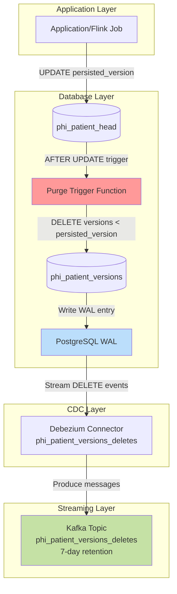
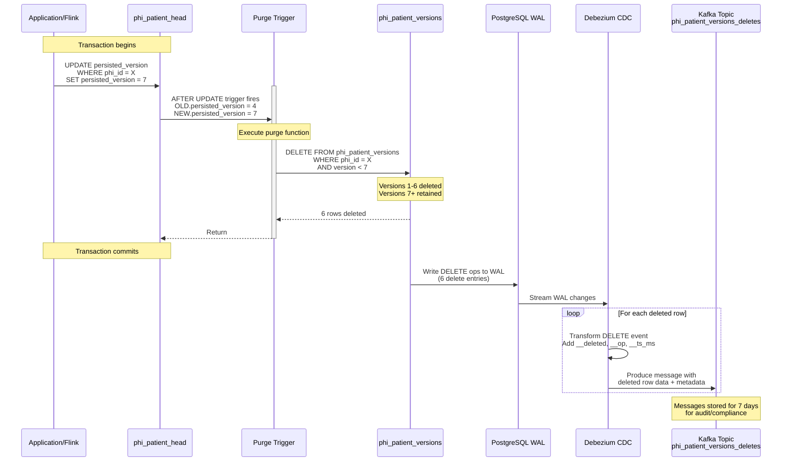

# PHI Version Purge & Delete Tracking

## Overview
When `phi_patient_head.persisted_version` is updated, the system automatically purges older PHI version rows to bound storage while capturing delete events for audit and compliance.

## Architecture



## Purge Trigger Mechanism

### Database Objects
A Postgres trigger is installed via Liquibase changeSet `041-phi-version-purge-trigger`:

- **Trigger**: `trg_purge_old_phi_versions_on_persisted_update`
- **Table**: `phi_patient_head`
- **Event**: `AFTER UPDATE OF persisted_version`
- **Scope**: `FOR EACH ROW`
- **Guard**: runs only when `persisted_version` actually changes (`OLD.persisted_version IS DISTINCT FROM NEW.persisted_version`)

The trigger executes function `purge_old_phi_versions_on_persisted_update()`:
- Deletes from `phi_patient_versions`
- Filtered by same `phi_id` as the updated head row
- Purges rows where `version < NEW.persisted_version`

### Sequence Diagram



## Runtime Behavior

### Example Flow
If `persisted_version` updates from `4` to `7`:
1. Versions `1..6` for that `phi_id` are **deleted** from `phi_patient_versions`
2. Versions `7+` are **retained**
3. Each deleted row generates a message in `phi_patient_versions_deletes` topic

### Delete Message Format
Each delete event contains:
- **All column values from the deleted row including PHI data**:
  - Identifiers: `phi_id`, `de_id`, `version`, `event_id`
  - **PHI fields**: `name`, `dob`
  - Non-PHI: `favorite_color`
  - Metadata: `request_hash`, `created_at`
- Metadata fields added by Debezium:
  - `__deleted`: `true` (indicates this is a delete event)
  - `__op`: `"d"` (operation type)
  - `__ts_ms`: timestamp of the delete operation

**Security Note**: These messages contain PHI and must be treated as PHI data with appropriate access controls and encryption.

## Delete Tracking System

### Debezium Connector: `phi_patient_versions_deletes`
- Dedicated CDC connector that **only** captures DELETE operations
- Uses separate replication slot: `phi_patient_versions_deletes_slot`
- Skips CREATE and UPDATE operations via `skipped.operations: c,u`
- **Captures all row columns including PHI data** (name, dob) for complete audit trail
- **Requires `REPLICA IDENTITY FULL`** on `phi_patient_versions` table so PostgreSQL WAL includes all column values on DELETE (not just primary key)
- Configuration: `infra/debezium/connectors/phi_patient_versions_deletes.json`

### Kafka Topic: `phi_patient_versions_deletes`
- **Retention**: 7 days (604800000 ms)
- **Partitions**: 3
- **Purpose**: Stores deleted records with metadata for audit trail
- Configuration: `infra/kafka/topics/phi_patient_versions_deletes.env`

### CDC Flow
1. Application/Flink updates `phi_patient_head.persisted_version`
2. Trigger deletes matching rows from `phi_patient_versions`
3. PostgreSQL WAL captures DELETE operations
4. Debezium connector reads WAL entries
5. Connector transforms and routes to `phi_patient_versions_deletes` topic
6. Messages stored for 7 days for compliance/audit access

## Use Cases

### Delete Tracking
- **Compliance audit trail** for deleted PHI data
- **Recovery/rollback scenarios** - deleted data available for 7 days
- **Monitoring purge trigger effectiveness** - track volume and timing of purges
- **Data retention policy enforcement tracking**

### Storage Management
- Bounded storage growth - only recent versions retained in database
- Lower read/write amplification
- Predictable query performance on `phi_patient_versions`

## Safety and Tradeoffs

### Transactional Guarantees
- Purge happens in the **same transaction** as the update to `phi_patient_head`
- Atomic: either both succeed or both rollback
- No orphaned versions or inconsistent state

### Data Retention
- Database: Data removal is **irreversible** unless restored from backup
- Kafka: Deleted records available for **7 days** in `phi_patient_versions_deletes` topic
- After 7 days: Kafka messages purged, data unrecoverable

### Design Priorities
- ✅ Bounded storage and predictable performance
- ✅ Audit trail for compliance (7-day window)
- ✅ Lower read/write amplification
- ⚠️ Full PHI history not retained in database
- ⚠️ Recovery window limited to Kafka retention period

## Configuration Files
- Trigger: `infra/liquibase/liquibase.yaml` (changeSet 041)
- Debezium connector: `infra/debezium/connectors/phi_patient_versions_deletes.json`
- Kafka topic: `infra/kafka/topics/phi_patient_versions_deletes.env`

## Testing
Run the integration test to verify trigger behavior:
```bash
python3 infra/scripts/test_persisted_version_purge_trigger.py
```

Or with debug output:
```bash
DEBUG=true python3 infra/scripts/test_persisted_version_purge_trigger.py
```
